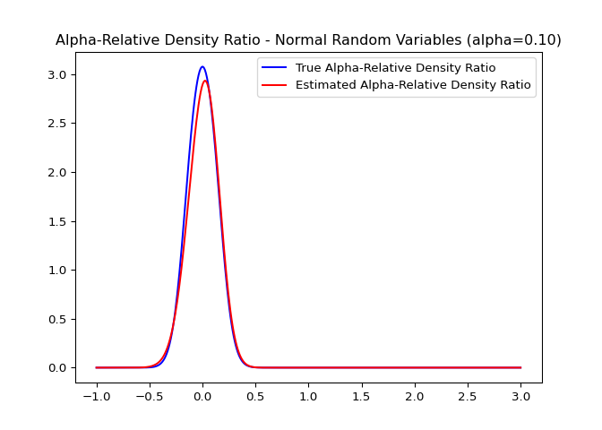

<!-- README.md is generated from README.Rmd. Please edit that file -->

[](https://travis-ci.org/hoxo-m/densratio_py)
[](https://pypi.python.org/pypi/densratio)
[](https://pypi.python.org/pypi/densratio)
[](https://coveralls.io/github/hoxo-m/densratio_py?branch=master)

## 1\. Overview

**Density ratio estimation** is described as follows: for given two data
samples `x1` and `x2` from unknown distributions `p(x)` and `q(x)`
respectively, estimate `w(x) = p(x) / q(x)`, where `x1` and `x2` are
d-dimensional real numbers.

The estimated density ratio function `w(x)` can be used in many
applications such as the inlier-based outlier detection \[1\] and
covariate shift adaptation \[2\]. Other useful applications for density
ratio estimation were summarized by Sugiyama et al. (2012) in \[3\].

The package **densratio** provides a function `densratio()` that returns
an object with a method to estimate density ratio as
`compute_density_ratio()`.

Further, the alpha-relative density ratio `p(x)/(alpha * p(x) + (1 -
alpha) * q(x))` (where alpha is in the range \[0, 1\]) can also be
estimated. When alpha is 0, this reduces to the ordinary density ratio
`w(x)`. The alpha-relative PE-divergence and KL-divergence between
`p(x)` and `q(x)` are also computed.

<!-- -->

For example,

``` python
import numpy as np
from scipy.stats import norm
from densratio import densratio

np.random.seed(1)
x = norm.rvs(size=500, loc=0, scale=1./8)
y = norm.rvs(size=500, loc=0, scale=1./2)
alpha = 0.1
densratio_obj = densratio(x, y, alpha=alpha)
print(densratio_obj)
```

gives the following output:

    #> Method: RuLSIF
    #> 
    #> Alpha: 0.1
    #> 
    #> Kernel Information:
    #>   Kernel type: Gaussian
    #>   Number of kernels: 100
    #>   Bandwidth(sigma): 0.1
    #>   Centers: matrix([[-0.09591373],..
    #> 
    #> Kernel Weights (theta):
    #>   array([0.04990797, 0.0550548 , 0.04784736, 0.04951904, 0.04840418,..
    #> 
    #> Regularization Parameter (lambda): 0.1
    #> 
    #> Alpha-Relative PE-Divergence: 0.6187941335987046
    #> 
    #> Alpha-Relative KL-Divergence: 0.7037648129307482
    #> 
    #> Function to Estimate Density Ratio:
    #>   compute_density_ratio(x)
    #> 

In this case, the true density ratio `w(x)` is known, so we can compare
`w(x)` with the estimated density ratio `w-hat(x)`. The code below gives
the plot shown above.

``` python
from matplotlib import pyplot as plt
from numpy import linspace

def true_alpha_density_ratio(sample):
    return norm.pdf(sample, 0, 1./8) / (alpha * norm.pdf(sample, 0, 1./8) + (1 - alpha) * norm.pdf(sample, 0, 1./2))

def estimated_alpha_density_ratio(sample):
    return densratio_obj.compute_density_ratio(sample)

sample_points = np.linspace(-1, 3, 400)
plt.plot(sample_points, true_alpha_density_ratio(sample_points), 'b-', label='True Alpha-Relative Density Ratio')
plt.plot(sample_points, estimated_alpha_density_ratio(sample_points), 'r-', label='Estimated Alpha-Relative Density Ratio')
plt.title("Alpha-Relative Density Ratio - Normal Random Variables (alpha={:03.2f})".format(alpha))
plt.legend()
plt.show()
```

## 2\. Installation

You can install the package from
[PyPI](https://pypi.python.org/pypi/densratio).

``` :sh
$ pip install densratio
```

Also, you can install the package from
[GitHub](https://github.com/hoxo-m/densratio_py).

``` :sh
$ pip install git+https://github.com/hoxo-m/densratio_py.git
```

The source code for **densratio** package is available on GitHub at
<https://github.com/hoxo-m/densratio_py>.

## 3\. Details

### 3.1. Basics

The package provides `densratio()`. The function returns an object that
has a function to compute estimated density ratio.

For data samples `x` and `y`,

``` python
from scipy.stats import norm
from densratio import densratio

x = norm.rvs(size = 200, loc = 1, scale = 1./8)
y = norm.rvs(size = 200, loc = 1, scale = 1./2)
result = densratio(x, y)
```

In this case, `result.compute_density_ratio()` can compute estimated
density ratio.

``` python
from matplotlib import pyplot as plt

density_ratio = result.compute_density_ratio(y)

plt.plot(y, density_ratio, "o")
plt.xlabel("x")
plt.ylabel("Density Ratio")
plt.show()
```

<!-- -->

### 3.2. The Method

The package estimates density ratio by the RuLSIF method.

**RuLSIF** (Relative unconstrained Least-Squares Importance Fitting)
estimates the alpha-relative density ratio by minimizing the squared
loss between the true and estimated alpha-relative ratios. You can find
more information in Hido et al. (2011) \[1\] and Liu et al (2013) \[4\].

The method assumes that the alpha-relative density ratio is represented
by a linear kernel model:

`w(x) = theta1 * K(x, c1) + theta2 * K(x, c2) + ... + thetab * K(x, cb)`
where `K(x, c) = exp(- ||x - c||^2 / (2 * sigma ^ 2))` is the Gaussian
RBF kernel.

`densratio()` performs the following: - Decides kernel parameter `sigma`
by cross-validation. - Optimizes for kernel weights `theta`. - Computes
the alpha-relative PE-divergence and KL-divergence from the learned
alpha-relative ratio.

As the result, you can obtain `compute_density_ratio()`, which will
compute the alpha-relative density ratio at the passed coordinates.

### 3.3. Result and Parameter Settings

`densratio()` outputs the result like as follows:

    #> Method: RuLSIF
    #> 
    #> Alpha: 0
    #> 
    #> Kernel Information:
    #>   Kernel type: Gaussian
    #>   Number of kernels: 100
    #>   Bandwidth(sigma): 0.1
    #>   Centers: matrix([[0.92113356],..
    #> 
    #> Kernel Weights (theta):
    #>   array([0.08848922, 0.03377533, 0.0753727 , 0.06141277, 0.02543963,..
    #> 
    #> Regularization Parameter (lambda): 1.0
    #> 
    #> Alpha-Relative PE-Divergence: 0.9635169300831035
    #> 
    #> Alpha-Relative KL-Divergence: 0.8388266265473269
    #> 
    #> Function to Estimate Density Ratio:
    #>   compute_density_ratio(x)
    #> 

  - **Method** is fixed as RuLSIF.
  - **Kernel type** is fixed as Gaussian RBF.
  - **Number of kernels** is the number of kernels in the linear model.
    You can change by setting `kernel_num` parameter. In default,
    `kernel_num = 100`.
  - **Bandwidth(sigma)** is the Gaussian kernel bandwidth. In default,
    `sigma = "auto"`, the algorithm automatically select an optimal
    value by cross validation. If you set `sigma` a number, that will be
    used. If you set `sigma` a numeric array, the algorithm select an
    optimal value in them by cross validation.
  - **Centers** are centers of Gaussian kernels in the linear model.
    These are selected at random from the data sample `x` underlying a
    numerator distribution `p(x)`. You can find the whole values in
    `result.kernel_info.centers`.
  - **Kernel weights(theta)** are theta parameters in the linear kernel
    model. You can find these values in `result.theta`.
  - **The function to estimate the alpha-relative density ratio** is
    named `compute_density_ratio()`.

## 4\. Multi Dimensional Data Samples

So far, we have deal with one-dimensional data samples `x` and `y`.
`densratio()` allows to input multidimensional data samples as
`numpy.ndarray` or `numpy.matrix`, as long as their dimensions are the
same.

For example,

``` python
from scipy.stats import multivariate_normal
from densratio import densratio

np.random.seed(1)
x = multivariate_normal.rvs(size=3000, mean=[1, 1], cov=[[1. / 8, 0], [0, 1. / 8]])
y = multivariate_normal.rvs(size=3000, mean=[1, 1], cov=[[1. / 2, 0], [0, 1. / 2]])
alpha = 0
densratio_obj = densratio(x, y, alpha=alpha, sigma_range=[0.1, 0.3, 0.5, 0.7, 1], lambda_range=[0.01, 0.02, 0.03, 0.04, 0.05])
print(densratio_obj)
```

gives the following output:

    #> Method: RuLSIF
    #> 
    #> Alpha: 0
    #> 
    #> Kernel Information:
    #>   Kernel type: Gaussian
    #>   Number of kernels: 100
    #>   Bandwidth(sigma): 0.3
    #>   Centers: matrix([[1.01477443, 1.38864061],..
    #> 
    #> Kernel Weights (theta):
    #>   array([0.06151164, 0.08012094, 0.10467369, 0.13868176, 0.14917063,..
    #> 
    #> Regularization Parameter (lambda): 0.04
    #> 
    #> Alpha-Relative PE-Divergence: 0.653615870855595
    #> 
    #> Alpha-Relative KL-Divergence: 0.6214285743087549
    #> 
    #> Function to Estimate Density Ratio:
    #>   compute_density_ratio(x)
    #> 

In this case, as well, we can compare the true density ratio with the
estimated density ratio.

``` python
from matplotlib import pyplot as plt
from numpy import linspace, dstack, meshgrid, concatenate

def true_alpha_density_ratio(x):
    return multivariate_normal.pdf(x, [1., 1.], [[1. / 8, 0], [0, 1. / 8]]) / \
           (alpha * multivariate_normal.pdf(x, [1., 1.], [[1. / 8, 0], [0, 1. / 8]]) + (1 - alpha) * multivariate_normal.pdf(x, [1., 1.], [[1. / 2, 0], [0, 1. / 2]]))

def estimated_alpha_density_ratio(x):
    return densratio_obj.compute_density_ratio(x)

range_ = np.linspace(0, 2, 200)
grid = np.concatenate(np.dstack(np.meshgrid(range_, range_)))
levels = [0, 0.5, 1, 1.5, 2, 2.5, 3, 3.5, 4.5]

plt.figure(figsize=(10, 4))
plt.subplot(1, 2, 1)
plt.contourf(range_, range_, true_alpha_density_ratio(grid).reshape(200, 200), levels)
#> <matplotlib.contour.QuadContourSet object at 0x1a22cda0f0>
plt.colorbar()
#> <matplotlib.colorbar.Colorbar object at 0x1a24bad8d0>
plt.title("True Alpha-Relative Density Ratio")
plt.subplot(1, 2, 2)
plt.contourf(range_, range_, estimated_alpha_density_ratio(grid).reshape(200, 200), levels)
#> <matplotlib.contour.QuadContourSet object at 0x1a22ce69b0>
plt.colorbar()
#> <matplotlib.colorbar.Colorbar object at 0x1a255e9a20>
plt.title("Estimated Alpha-Relative Density Ratio")
plt.show()
```

<!-- -->

## 5\. References

\[1\] Hido, S., Tsuboi, Y., Kashima, H., Sugiyama, M., & Kanamori, T.
**Statistical outlier detection using direct density ratio estimation.**
Knowledge and Information Systems 2011.

\[2\] Sugiyama, M., Nakajima, S., Kashima, H., von Bünau, P. & Kawanabe,
M. **Direct importance estimation with model selection and its
application to covariate shift adaptation.** NIPS 2007.

\[3\] Sugiyama, M., Suzuki, T. & Kanamori, T. **Density Ratio Estimation
in Machine Learning.** Cambridge University Press 2012.

\[4\] Liu, S., Yamada, M., Collier, N., & Sugiyama, M. **Change-Point
Detection in Time-Series Data by Relative Density-Ratio Estimation**
Neural Networks, 2013.
